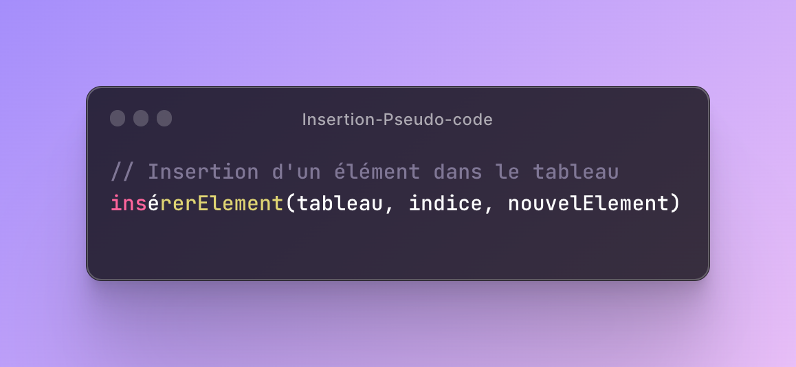
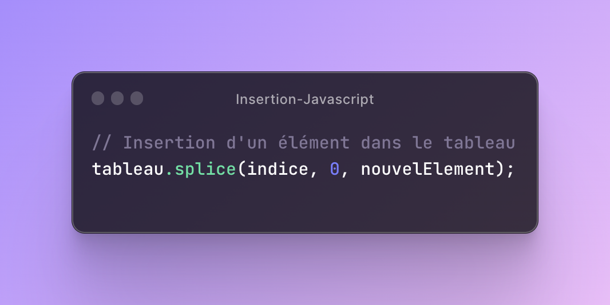

## **Structures de données fondamentales :**

Une structure de données est une manière organisée de stocker, gérer et manipuler des données de manière efficace. Elle définit la manière dont les données sont organisées, accessibles et modifiées. Les structures de données permettent de résoudre des problèmes spécifiques de manière optimisée en fournissant des opérations et des algorithmes appropriés.

Une structure de données peut être vue comme un conteneur qui offre différentes opérations pour ajouter, supprimer, rechercher et manipuler les données qu'elle contient. Elle définit également les règles de gestion des données, telles que l'ordre dans lequel elles sont stockées, leur relation et leur accessibilité.

Les structures de données peuvent varier en fonction de la complexité et de l'organisation des données. Elles peuvent être linéaires, comme les tableaux et les listes, ou non linéaires, comme les arbres et les graphes. Chaque structure de données a ses propres caractéristiques, avantages et inconvénients, adaptés à des types de problèmes spécifiques.

**-Tableaux (arrays) : manipulation, recherche, insertion, suppression.**

Les tableaux, également connus sous le nom d'arrays, sont des structures de données linéaires qui permettent de stocker une collection d'éléments de même type. Voici comment effectuer différentes opérations sur les tableaux :

1. Manipulation : La manipulation d'un tableau fait référence aux opérations permettant d'accéder aux éléments du tableau, de les modifier ou de les traiter d'une manière spécifique. Cela inclut l'accès à un élément par son index, la modification de la valeur d'un élément existant, l'ajout d'éléments supplémentaires ou la suppression d'éléments.

   
   

2. Recherche : La recherche dans un tableau consiste à trouver un élément spécifique à l'aide d'une valeur donnée. Cela peut être réalisé en parcourant le tableau et en comparant chaque élément avec la valeur recherchée. Si une correspondance est trouvée, l'indice de l'élément peut être retourné ou une indication peut être donnée sur sa présence dans le tableau.

3. Insertion : L'insertion dans un tableau se réfère à l'ajout d'un nouvel élément à une position spécifique du tableau. Cela peut être effectué en décalant les éléments existants vers la droite (pour faire de la place) et en insérant le nouvel élément à l'indice souhaité. L'insertion peut également se faire à la fin du tableau en ajoutant simplement l'élément à la dernière position.

4. Suppression :
   - Suppression par indice : Pour supprimer un élément à un indice donné, vous devrez décaler les éléments suivants vers la gauche pour combler l'espace vacant.
   - Suppression par valeur : Si vous souhaitez supprimer une occurrence spécifique d'une valeur dans le tableau, vous devrez rechercher l'indice de cette valeur, puis supprimer l'élément à cet indice en décalant les éléments suivants vers la gauche.

Il est important de noter que les opérations d'insertion et de suppression peuvent entraîner des décalages importants dans le tableau, ce qui peut être coûteux en termes de performances pour les tableaux de grande taille.

**-Listes chaînées : concepts de base, opérations, avantages et inconvénients.**

**-Piles (stacks) : principes, opérations (push, pop), applications.**

**-Files d'attente (queues) : principes, opérations (enqueue, dequeue), applications.**