## **Structures de données fondamentales :**

Une structure de données est une manière organisée de stocker, gérer et manipuler des données de manière efficace. Elle définit la manière dont les données sont organisées, accessibles et modifiées. Les structures de données permettent de résoudre des problèmes spécifiques de manière optimisée en fournissant des opérations et des algorithmes appropriés.

Une structure de données peut être vue comme un conteneur qui offre différentes opérations pour ajouter, supprimer, rechercher et manipuler les données qu'elle contient. Elle définit également les règles de gestion des données, telles que l'ordre dans lequel elles sont stockées, leur relation et leur accessibilité.

Les structures de données peuvent varier en fonction de la complexité et de l'organisation des données. Elles peuvent être linéaires, comme les tableaux et les listes, ou non linéaires, comme les arbres et les graphes. Chaque structure de données a ses propres caractéristiques, avantages et inconvénients, adaptés à des types de problèmes spécifiques.

**-Tableaux (arrays) : manipulation, recherche, insertion, suppression.**

Les tableaux, également connus sous le nom d'arrays, sont des structures de données linéaires qui permettent de stocker une collection d'éléments de même type. Voici comment effectuer différentes opérations sur les tableaux :

1. Manipulation : La manipulation d'un tableau fait référence aux opérations permettant d'accéder aux éléments du tableau, de les modifier ou de les traiter d'une manière spécifique. Cela inclut l'accès à un élément par son index, la modification de la valeur d'un élément existant, l'ajout d'éléments supplémentaires ou la suppression d'éléments.

   
   


2. Recherche : La recherche dans un tableau consiste à trouver un élément spécifique à l'aide d'une valeur donnée. Cela peut être réalisé en parcourant le tableau et en comparant chaque élément avec la valeur recherchée. Si une correspondance est trouvée, l'indice de l'élément peut être retourné ou une indication peut être donnée sur sa présence dans le tableau.


3. Insertion : L'insertion dans un tableau se réfère à l'ajout d'un nouvel élément à une position spécifique du tableau. Cela peut être effectué en décalant les éléments existants vers la droite (pour faire de la place) et en insérant le nouvel élément à l'indice souhaité. L'insertion peut également se faire à la fin du tableau en ajoutant simplement l'élément à la dernière position.


4. Suppression : La suppression d'éléments dans un tableau consiste à enlever un élément spécifique du tableau. Cela peut être réalisé en décalant les éléments suivants vers la gauche (pour remplir l'espace vide) après la suppression de l'élément ciblé. La suppression peut être basée sur l'indice de l'élément ou sa valeur, selon le cas.


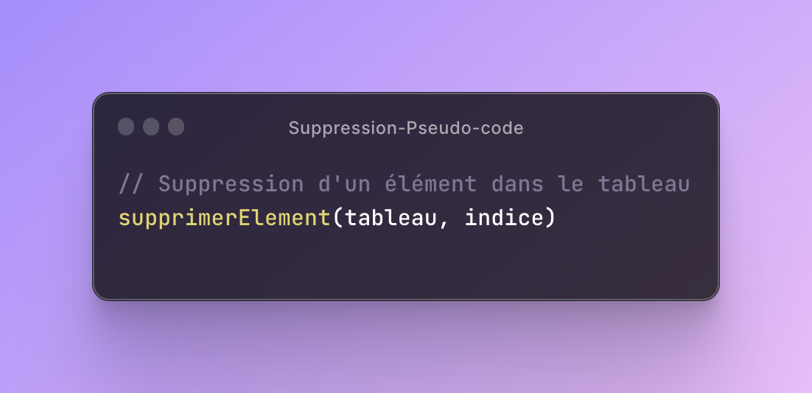
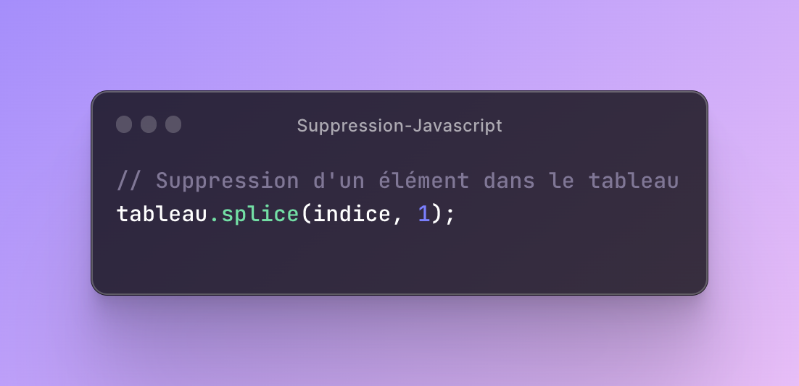

Ces opérations de manipulation, recherche, insertion et suppression sont fondamentales pour travailler avec des tableaux et permettent de gérer et de traiter les données stockées de manière efficace.

**-Listes chaînées : concepts de base, opérations, avantages et inconvénients.**

Les listes chaînées sont des structures de données linéaires qui permettent de stocker et d'organiser des éléments de manière dynamique. Voici les concepts de base, les opérations, ainsi que les avantages et les inconvénients des listes chaînées :

Concepts de base :
- Une liste chaînée est composée de nœuds, où chaque nœud contient une valeur et un pointeur (référence) vers le nœud suivant dans la liste.

- Le premier nœud de la liste est appelé "tête" (head), et le dernier nœud est généralement un nœud spécial appelé "sentinelle" ou "sentinelle de fin" (tail).
- Les nœuds d'une liste chaînée sont généralement créés dynamiquement, ce qui permet une allocation flexible de la mémoire en fonction des besoins.

Opérations courantes :
- Insertion : Permet d'ajouter un nouvel élément à la liste chaînée, que ce soit en tête, en fin ou à une position spécifique.

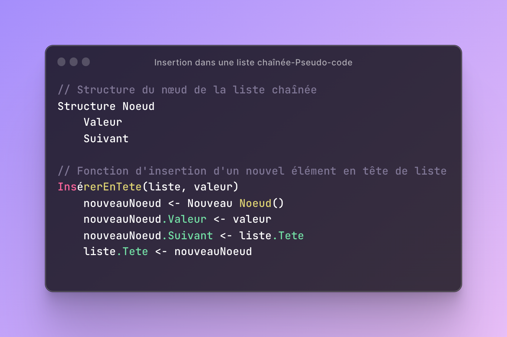
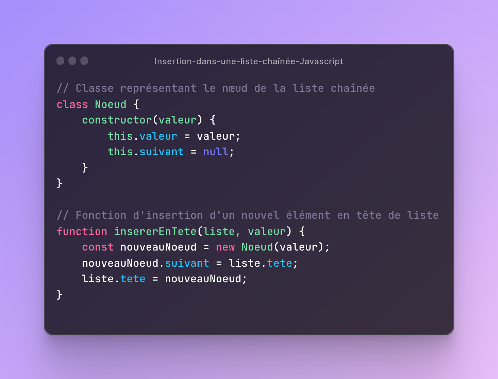

- Suppression : Permet de retirer un élément de la liste chaînée en mettant à jour les pointeurs appropriés.

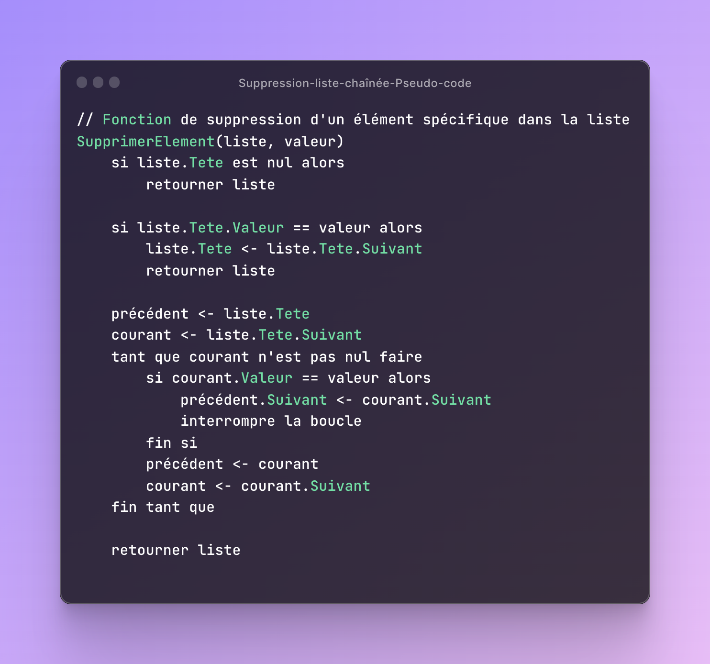
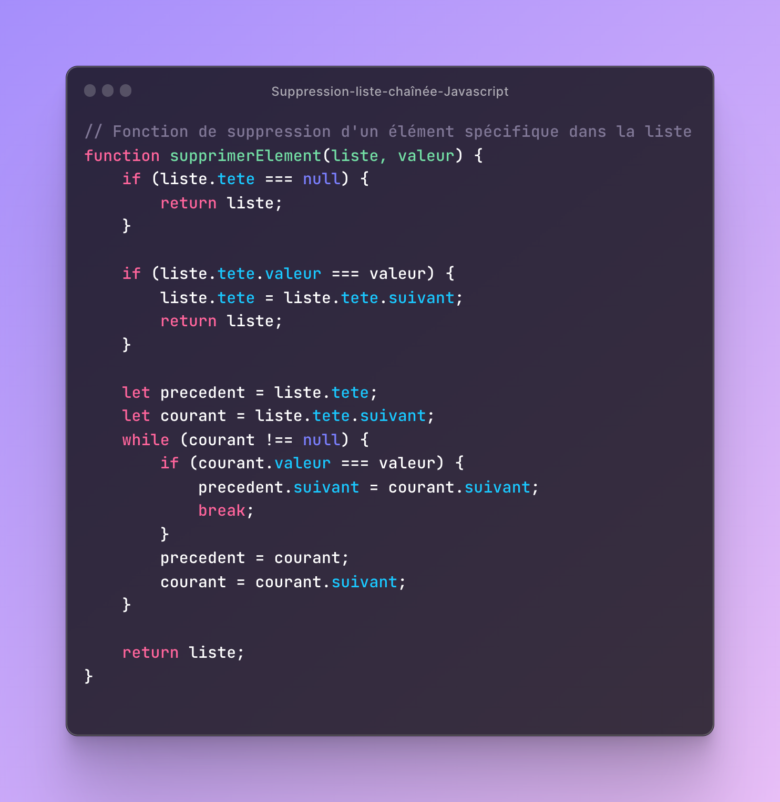

- Recherche : Permet de trouver un élément spécifique dans la liste chaînée en parcourant les nœuds de manière séquentielle.

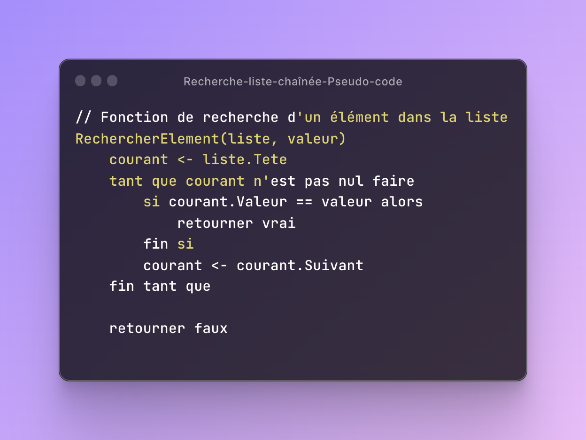
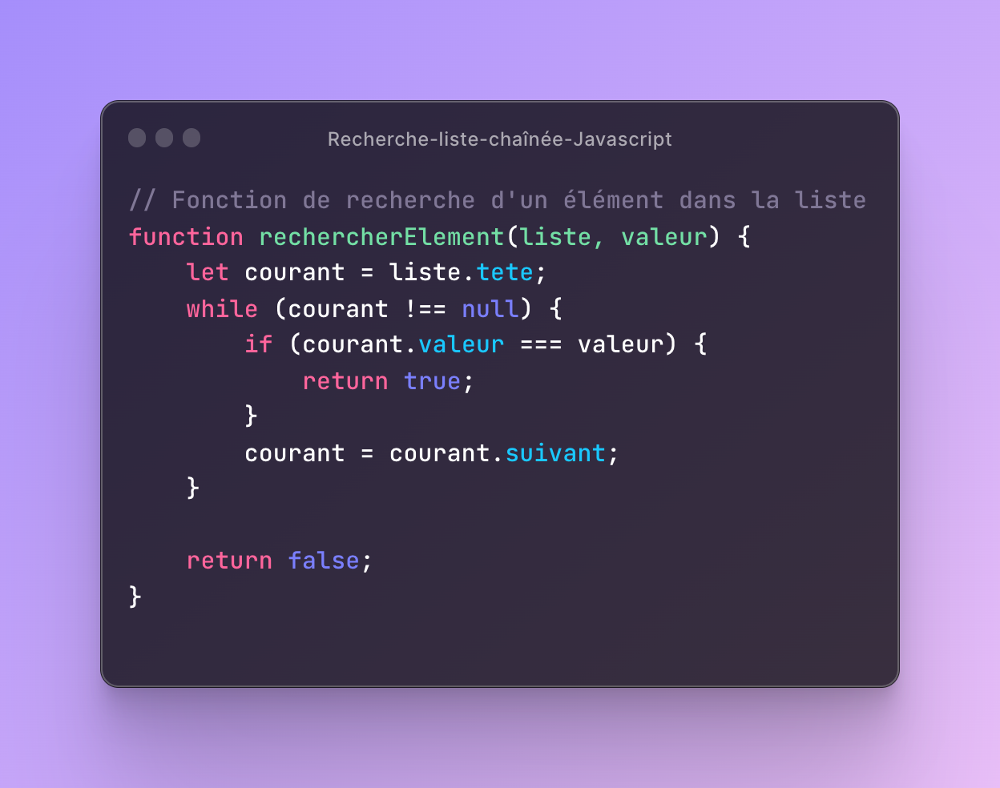

- Parcours : Permet de parcourir tous les éléments de la liste chaînée pour les afficher ou les traiter.

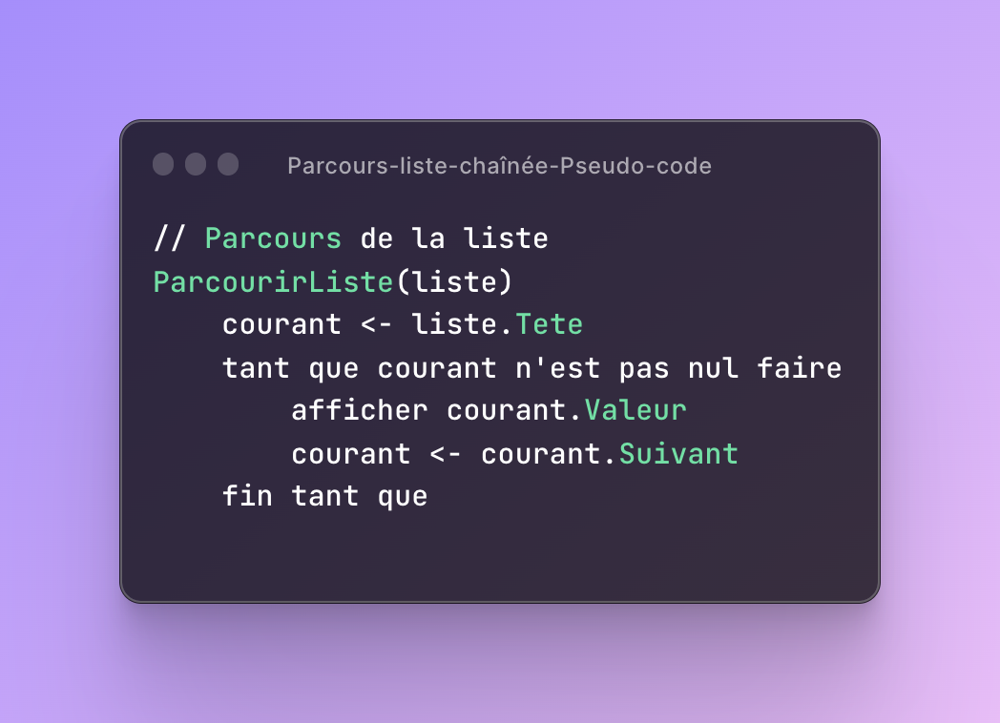
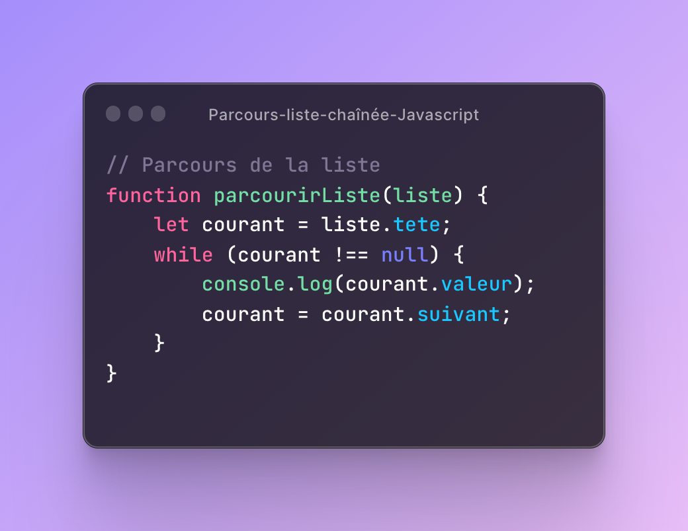

- Accès : Bien que les listes chaînées ne supportent pas un accès direct par indice comme les tableaux, il est possible d'accéder à un élément en suivant les pointeurs à partir de la tête de liste.


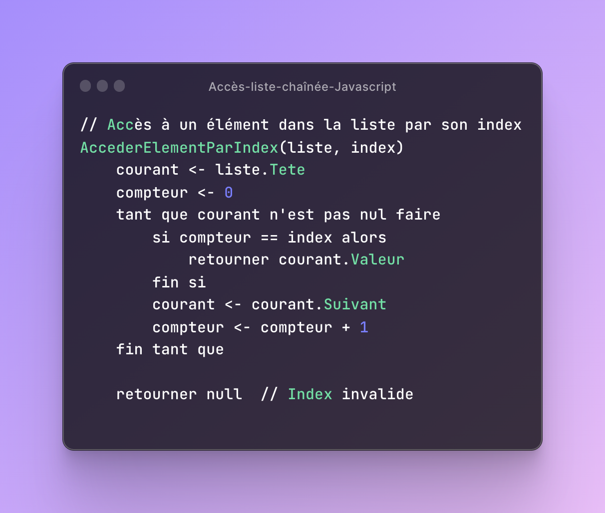

Avantages des listes chaînées :
- Allocation dynamique : Les nœuds des listes chaînées peuvent être alloués et libérés dynamiquement, permettant une gestion flexible de la mémoire.
- Insertion et suppression efficaces : Comparées aux tableaux, les listes chaînées peuvent insérer et supprimer des éléments plus efficacement, car elles n'impliquent pas le décalage d'autres éléments.
- Taille variable : Les listes chaînées peuvent être facilement étendues ou réduites en fonction des besoins, sans nécessiter une allocation continue de mémoire.

Inconvénients des listes chaînées :
- Accès séquentiel : Contrairement aux tableaux, l'accès aux éléments d'une liste chaînée nécessite un parcours séquentiel à partir de la tête, ce qui peut être moins efficace pour des opérations de recherche aléatoire.
- Utilisation de mémoire supplémentaire : Les listes chaînées nécessitent de la mémoire supplémentaire pour stocker les pointeurs de chaque nœud, ce qui peut augmenter l'utilisation de mémoire par rapport aux tableaux.

Les listes chaînées sont couramment utilisées lorsque la taille des données est inconnue à l'avance ou lorsqu'il est nécessaire d'effectuer des opérations d'insertion et de suppression fréquentes. Elles offrent une structure de données flexible et efficiente pour de nombreux problèmes informatiques.

**-Piles (stacks) : principes, opérations (push, pop), applications.**

Les piles (stacks) sont des structures de données linéaires qui suivent le principe du "dernier entré, premier sorti" (Last-In-First-Out, LIFO). Elles sont souvent comparées à une pile d'objets réels, où le dernier objet placé sur la pile est le premier à être retiré. Voici les principes de base, les opérations courantes et les applications des piles :

Principes de base des piles :
- Les piles sont des structures de données abstraites qui peuvent être implémentées à l'aide de tableaux ou de listes chaînées.
- Les éléments sont ajoutés (poussés) et retirés (dépilés) uniquement à partir de l'extrémité supérieure de la pile, également appelée "sommet" (top) de la pile.
- Les éléments situés en dessous du sommet de la pile sont inaccessibles tant que le sommet n'est pas retiré.

Opérations courantes sur les piles :
- Push (empiler) : Ajoute un nouvel élément au sommet de la pile.
- Pop (dépiler) : Retire l'élément du sommet de la pile et le renvoie.
- Peek (regarder) : Consulte l'élément situé au sommet de la pile sans le retirer.
- IsEmpty (est vide) : Vérifie si la pile est vide.
- Size (taille) : Renvoie le nombre d'éléments présents dans la pile.

Applications des piles :
- Gestion des appels de fonctions : Les piles sont utilisées pour suivre l'ordre d'exécution des fonctions dans de nombreux langages de programmation.
- Undo/Redo : Les piles peuvent être utilisées pour mettre en œuvre les fonctionnalités d'annulation et de répétition d'actions dans les éditeurs de texte, les logiciels graphiques, etc.
- Évaluation d'expressions : Les piles peuvent être utilisées pour évaluer des expressions arithmétiques, notamment pour la conversion entre les formes infixées, postfixées et préfixées.
- Navigation dans les arbres : Les piles sont utilisées pour effectuer des parcours d'arbres en profondeur (depth-first traversal), tels que les parcours en profondeur d'abord (Depth-First Search, DFS).

Voici un exemple d'implémentation en JavaScript des opérations de pile (push, pop) à l'aide d'un tableau :

```javascript
class Pile {
  constructor() {
    this.elements = [];
  }

  push(element) {
    this.elements.push(element);
  }

  pop() {
    if (this.isEmpty()) {
      return null;
    }
    return this.elements.pop();
  }

  peek() {
    if (this.isEmpty()) {
      return null;
    }
    return this.elements[this.elements.length - 1];
  }

  isEmpty() {
    return this.elements.length === 0;
  }

  size() {
    return this.elements.length;
  }
}

// Exemple d'utilisation de la pile
const pile = new Pile();
pile.push(1);
pile.push(2);
pile.push(3);

console.log(pile.pop()); // Sortie : 3
console.log(pile.peek()); // Sortie : 2
console.log(pile.size()); // Sortie : 2
console.log(pile.isEmpty()); // Sortie : false
```

Dans cet exemple, la classe `Pile` est implémentée à l'aide d'un tableau (`this.elements`). Les opérations de pile (push, pop, peek, isEmpty, size) sont définies comme des méthodes de la classe. Vous pouvez créer une instance de la pile, ajouter des éléments avec `push`, retirer des éléments avec `pop`, consulter l'élément au sommet avec `peek`, vérifier si la pile est vide avec `isEmpty` et obtenir la taille de la pile avec `size`.


**-Files d'attente (queues) : principes, opérations (enqueue, dequeue), applications.**

Les files d'attente (queues) sont des structures de données linéaires qui suivent le principe du "premier entré, premier sorti" (First-In-First-Out, FIFO). Contrairement aux piles, où le dernier élément ajouté est le premier à être retiré, les files d'attente traitent les éléments dans l'ordre chronologique de leur arrivée. Voici les principes de base, les opérations courantes et les applications des files d'attente :

Principes de base des files d'attente :
- Les files d'attente sont des structures de données abstraites qui peuvent être implémentées à l'aide de tableaux ou de listes chaînées.
- Les éléments sont ajoutés à la fin de la file d'attente (enqueue) et retirés du début de la file d'attente (dequeue).
- L'ordre dans lequel les éléments sont ajoutés est préservé lors de leur traitement.

Opérations courantes sur les files d'attente :
- Enqueue (ajouter en file) : Ajoute un nouvel élément à la fin de la file d'attente.
- Dequeue (retirer de la file) : Retire l'élément du début de la file d'attente et le renvoie.
- Front (premier élément) : Renvoie l'élément situé au début de la file d'attente sans le retirer.
- IsEmpty (est vide) : Vérifie si la file d'attente est vide.
- Size (taille) : Renvoie le nombre d'éléments présents dans la file d'attente.

Applications des files d'attente :
- Gestion des tâches : Les files d'attente sont couramment utilisées pour gérer les tâches en attente de traitement, comme les files d'impression, les demandes de service, etc.
- Ordonnancement des processus : Dans les systèmes d'exploitation, les files d'attente sont utilisées pour ordonnancer les processus et déterminer leur ordre d'exécution.
- Algorithme de parcours en largeur (BFS) : Les files d'attente sont utilisées pour mettre en œuvre le parcours en largeur des graphes, une technique utilisée dans les algorithmes de recherche et de résolution de problèmes.
- Simulation de file d'attente réelle : Les files d'attente peuvent être utilisées pour simuler des scénarios de file d'attente réelle, tels que les files d'attente de clients dans les supermarchés, les files d'attente de voitures dans les péages, etc.

Voici un exemple d'implémentation en JavaScript des opérations de file d'attente (enqueue, dequeue) à l'aide d'un tableau :

```javascript
class FileAttente {
  constructor() {
    this.elements = [];
  }

  enqueue(element) {
    this.elements.push(element);
  }

  dequeue() {
    if (this.isEmpty()) {
      return null;
    }
    return this.elements.shift();
  }

  front() {
    if (this.isEmpty()) {
      return null;
    }
    return this.elements[0];
  }

  isEmpty() {
    return this.elements.length === 0;
  }

  size() {
    return this.elements.length;
  }
}

// Exemple d'utilisation de la file d'attente
const file = new

 FileAttente();
file.enqueue('A');
file.enqueue('B');
file.enqueue('C');

console.log(file.dequeue()); // Sortie : 'A'
console.log(file.front()); // Sortie : 'B'
console.log(file.size()); // Sortie : 2
console.log(file.isEmpty()); // Sortie : false
```

Dans cet exemple, la classe `FileAttente` est implémentée à l'aide d'un tableau (`this.elements`). Les opérations de file d'attente (enqueue, dequeue, front, isEmpty, size) sont définies comme des méthodes de la classe. Vous pouvez créer une instance de la file d'attente, ajouter des éléments avec `enqueue`, retirer des éléments avec `dequeue`, consulter le premier élément avec `front`, vérifier si la file d'attente est vide avec `isEmpty` et obtenir la taille de la file d'attente avec `size`.
